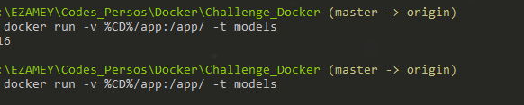

# CHALLENGE-Docker

>- Run a container and verify that it prints the ouput of your `model.py` file.

> -  Connect to your container with SSH and run all the python files `model.py`, `preprocessing.py`, `utils.py`

> -  Stop you container and delete it *(check that there are no more containers running with `docker container ls -a`)*

> - Run a new container using a volume to do changes without stopping the container and saving your changes. Connect to SSH so it stays running.

>- Add two lines of code in each files locally (be creative!)

>- Delete all your **containers** and **images**.

